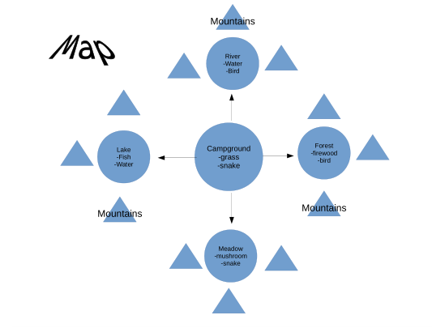
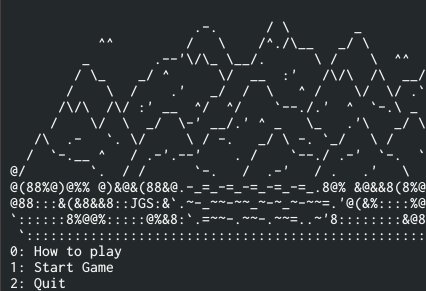

[docker]: http://52.36.73.75:9000/ "docker instance"

# hunting-game
A simple survival game where the person try to survive in the virtual
wilderness.  The plot of the game started simple where the person gathers
food and face wild animals where you can die of injury. This makes the game
more fun with risk and challenges.

## Map

## Start Game
You try the game at [docker]

